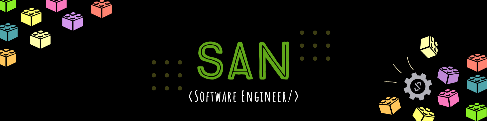

 
 
<h4 align="center">
:wave: <b> I am San--a Software Engineer, primarily focused in Backend Development. </b>
</h4>

---
 
<h4> Experiences: </h4>
  
- Developing FullStack Applications
- Computer Science Instructor to school students 
- Contributing to various Open Source projects

 

----
 
<h4> My Experiences Has:  </h4>

- Help me connect more with the world of programming, and how it can be used to solve real world problems
- Help me become better at explaining complex topics by breaking that topic into understandable sub-topics
- Made me realize it is <i>OKAY</i> to feel lost, with patience and determination everything will start to make sense

 

---
 
<h4> What am I upto? </h4>

- Working as a <b>Data Engineer</b>, to get into Machine Learning
- Volunteering in an <b>Non-Profit Organization</b> as a Software Developer, to address Climate Change and Poverty
- Contributing to more open source projects to learn more, and stay updated with new Frameworks and Libraries

 

 
Reach Me: 
 
&#128071;
 
 
 

 
  

---

  

---
 

